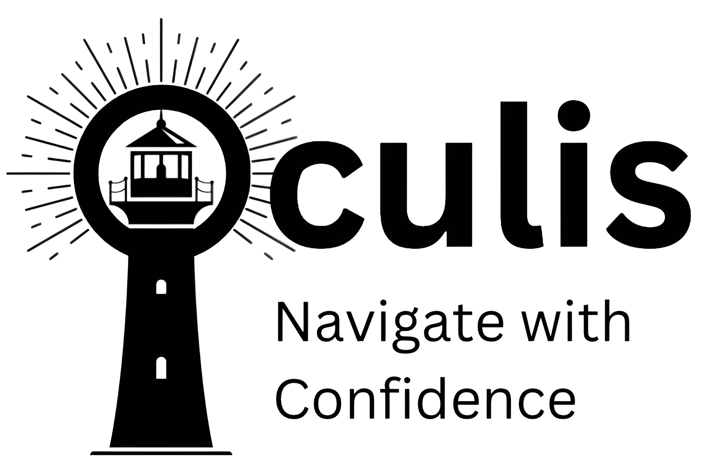

# Oculis: Navigation Assistant

<a href="https://www.wikipedia.com/" target="_blank"></a>

## Overview

Oculis is an iOS app designed to assist the visually impaired by identifying buses and their numbers in real-time. Using YOLO-based object detection, the app detects buses, reads bus numbers, and provides audio announcements.

**Why it matters:** In Singapore, 3 to 7 out of every 1,000 people are blind, with most affected individuals over 50. Existing navigation apps lack last-mile support, are costly, and aren’t optimized for Singapore’s transport system.

## Key Features

- **Real-Time Bus Detection**: Uses YOLO11n for accurate and efficient object detection.
- **Bus Number Recognition**: A second YOLO model scans for each number seperately which is then stitched together during post processing
- **Audio Announcements**: Provides real-time voice feedback.
- **Optimized for Singapore**: Fine-tuned on local data for better accuracy.
- **Lightweight & Fast**: Runs entirely on-device without an internet connection.

## How It Works

1. **Detect**: The YOLO11n model identifies buses in the camera feed.
2. **Recognize**: A second YOLO11n model recognises each number separately.
3. **Stitch**: The detected numbers are then stitched together to form the bus service number.
4. **Notify**: Announces the confirmed bus number via speech synthesis.

## Technical Implementation
- **AVFoundation**: Handles camera and speech synthesis
- **Model Optimization**: Distilled for mobile efficiency

## Planned Features

1. Announce when the user reaches their stop.
2. Detect road signs and signals.
3. Identify shop names and popular logos.
4. Expand product to Android Users

## Installation

1. Clone the repository:
   ```bash
   git clone https://github.com/yourusername/oculis.git
   cd oculis
   ```
2. Open `YOLO.xcodeproj` in Xcode.
3. Add the YOLO11n CoreML model to `YOLO/Models`.
4. Build and run on an iOS device.

## Privacy & Accessibility

- **Fully on-device**: No data sent to external servers.
- **Designed for accessibility**: Aimed at improving mobility for the visually impaired.

## Credits

Built on the [Ultralytics YOLO iOS App](https://github.com/ultralytics/yolo-ios-app), modified for public transit accessibility.

## License

This project follows the AGPL-3.0 license. For commercial use, contact us.

## Contributing

We welcome contributions! Submit issues, feature requests, or pull requests on GitHub.

---

**Oculis – Helping you see the world, one bus at a time.**

